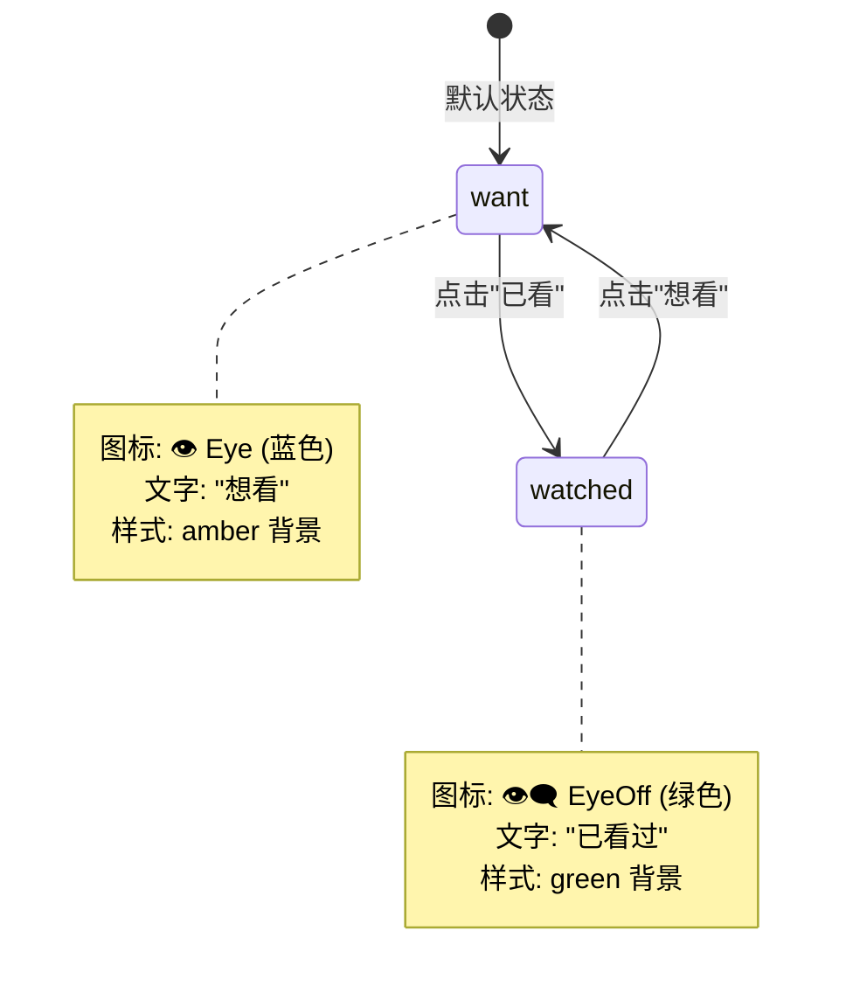
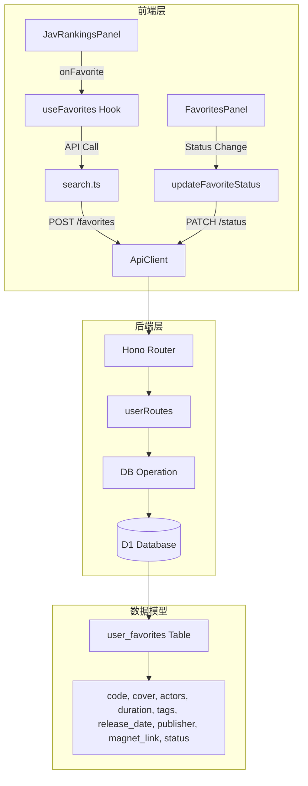

# CodeSeek 版本 3.0 变更日志

> 📖 [返回项目主页](../readme.md) | [v2.0 变更日志](changelogv.2.0.md) | [API接口文档](api/index.md) | [架构设计文档](backend-frontend-tree.md)

本文档详细记录 CodeSeek 从版本 2.0 升级到版本 3.0 的所有变更内容（commit `12b32c92` → `9fa3bf7`）。

---

## 目录

- [概述](#概述)
- [变更统计](#-变更统计)
- [🔒 安全性重大升级](#-安全性重大升级)
- [📊 数据模型扩展](#-数据模型扩展)
- [🎨 前端体验优化](#-前端体验优化)
- [⚙️ 后端架构改进](#-后端架构改进)
- [🗄️ 数据库变更](#️-数据库变更)
- [📦 依赖变更](#-依赖变更)
- [🔄 迁移指南](#-迁移指南)

---

## 概述

版本 3.0 是 CodeSeek 的**安全性与功能增强版本**，核心变化包括：

- **🔐 密码安全升级**: SHA-256 → PBKDF2-SHA256 (100,000次迭代)，向后兼容
- **📦 JAV 元数据支持**: 收藏/历史记录新增番号、封面、演员等 8+ 字段
- **🎯 收藏状态管理**: 新增"想看/已看"状态切换功能
- **🔧 Zod 数据验证**: 全面引入 Zod 4.4.3 进行运行时类型检查
- **🌐 CORS 策略强化**: 正则匹配域名，更严格的跨域控制
- **⚡ 认证架构优化**: 中间件统一 Token 管理，消除重复代码

**版本信息**
- 起始 commit: `12b32c92ca0cdb23929cce68a99149a1fdffe6bf`
- 结束 commit: `9fa3bf7fef171dc92d14d248a95f7421bad0ef37`
- 变更统计: **35 个文件修改**, **+1666 行 / -596 行**
- 发布日期: 2026-05-13

---

## 📊 变更统计

| 类别 | 文件数 | 新增行数 | 删除行数 |
|------|--------|---------|---------|
| 后端核心 | 15 | ~900 | ~350 |
| 前端组件 | 12 | ~600 | ~200 |
| 数据库脚本 | 3 | ~80 | 0 |
| 类型定义 | 3 | ~60 | 20 |
| 配置文件 | 2 | ~26 | 26 |

---

## 🔒 安全性重大升级

### 1. 密码哈希算法升级 ⭐⭐⭐

**变更文件**: [`backend/src/utils/index.ts`](backend/src/utils/index.ts)

#### 版本 2.0 (旧算法)
```typescript
// SHA-256 单轮哈希（不安全）
export const hashPassword = async (password: string): Promise<string> => {
  const encoder = new TextEncoder();
  const data = encoder.encode(password);
  const hashBuffer = await crypto.subtle.digest('SHA-256', data);
  const hashArray = Array.from(new Uint8Array(hashBuffer));
  return hashArray.map((b) => b.toString(16).padStart(2, '0')).join('');
};
```

#### 版本 3.0 (新算法)
```typescript
// PBKDF2-SHA256 + 盐值 + 100,000 次迭代
export const hashPassword = async (password: string): Promise<string> => {
  const salt = crypto.getRandomValues(new Uint8Array(16));
  const keyMaterial = await crypto.subtle.importKey(
    'raw', encoder.encode(password), 'PBKDF2', false, ['deriveBits']
  );
  
  const hashBuffer = await crypto.subtle.deriveBits(
    { name: 'PBKDF2', salt, iterations: 100000, hash: 'SHA-256' },
    keyMaterial, 256
  );
  
  // 格式: $pbkdf2-sha256$100000$<salt_base64>$<hash_base64>
  return `$pbkdf2-sha256$100000$${saltBase64}$${hashBase64}`;
};
```

#### 向后兼容验证
```typescript
export const verifyPassword = async (password: string, storedHash: string): Promise<boolean> => {
  // 自动检测新旧格式
  if (!storedHash.startsWith('$pbkdf2-sha256$')) {
    // 兼容旧的 SHA-256 格式
    const legacyHash = await legacySHA256(password);
    return legacyHash === storedHash;
  }
  // 新 PBKDF2 验证逻辑...
};
```

**安全收益**:
- ✅ 抗彩虹表攻击（随机盐值）
- ✅ 抗暴力破解（100,000次迭代 ≈ 增加 17 位熵）
- ✅ 符合 OWASP 密码存储最佳实践
- ✅ 无缝迁移（自动识别新旧格式）

### 2. Token 哈希分离 ⭐⭐

**变更原因**: 密码和 Token 使用不同哈希策略

```typescript
// 新增专用 Token 哈希函数（保持 SHA-256）
export const hashToken = async (token: string): Promise<string> => {
  const data = encoder.encode(token);
  const hashBuffer = await crypto.subtle.digest('SHA-256', data);
  // ...返回十六进制字符串
};
```

**影响范围**:
- 所有会话管理接口 (`/auth/me`, `/auth/refresh`, `/auth/verify-token`)
- 密码重置接口 (`/auth/reset-password`)
- 账户删除接口 (`/auth/account`)

### 3. CORS 策略强化 ⭐

**变更文件**: [`backend/src/index.ts`](backend/src/index.ts)

```typescript
app.use('*', cors({
  origin: (origin) => {
    if (!origin) return CONFIG.CORS.ALLOWED_ORIGINS[0]; // 处理 null origin
    
    // 白名单精确匹配
    if (CONFIG.CORS.ALLOWED_ORIGINS.includes(origin)) return origin;
    
    // 正则模式匹配
    const allowedPatterns = [
      /^https:\/\/codeseek\.pp\.ua$/,
      /^https:\/\/www\.codeseek\.pp\.ua$/,
      /^https:\/\/.*\.codeseek\.pages\.dev$/,
      /^http:\/\/localhost:\d+$/,
      /^http:\/\/127\.0\.0\.1:\d+$/,
    ];
    
    if (allowedPatterns.some(pattern => pattern.test(origin))) {
      return origin;
    }
    
    return null; // 明确拒绝未知来源
  },
}));
```

**安全改进**:
- ✅ 移除通配符匹配（原 `.endsWith('.pages.dev')` 过于宽松）
- ✅ 支持正则表达式精确控制
- ✅ 明确拒绝未授权来源（返回 `null` 而非默认允许）

---

## 📊 数据模型扩展

### 1. 收藏项元数据增强 ⭐⭐⭐

**新增字段** (8个):

| 字段名 | 类型 | 说明 | 示例 |
|--------|------|------|------|
| `code` | TEXT | 番号 | `ABC-123` |
| `cover` | TEXT | 封面图URL | `https://.../cover.jpg` |
| `actors` | TEXT | 演员（逗号分隔） | `张三,李四` |
| `duration` | TEXT | 时长 | `120` |
| `tags` | TEXT | 标签（逗号分隔） | `高清,字幕` |
| `release_date` | TEXT | 发行时间 | `2024-01-15` |
| `publisher` | TEXT | 发行商 | `S1 NO.1 STYLE` |
| `magnet_link` | TEXT | 磁力链接 | `magnet:?xt=urn:btih:...` |
| `status` | TEXT | 状态（want/watched） | `watched` |

**类型定义** ([`backend/src/types/index.ts`](backend/src/types/index.ts)):
```typescript
export interface UserFavorite {
  id: string;
  user_id: string;
  title: string;
  subtitle: string | null;
  url: string;
  icon: string | null;
  keyword: string | null;
  // ===== 新增字段 =====
  code: string | null;           // 番号
  cover: string | null;          // 封面图
  actors: string | null;         // 演员
  duration: string | null;       // 时长
  tags: string | null;           // 标签
  release_date: string | null;   // 发行时间
  publisher: string | null;      // 发行商
  magnet_link: string | null;    // 磁力链接
  status: string;                // want / watched
  created_at: number;
  updated_at: number;
}
```

### 2. 搜索历史元数据增强 ⭐⭐

**新增字段** (9个):
```typescript
export interface UserSearchHistory {
  id: string;
  user_id: string;
  query: string;
  source: string;
  results_count: number;
  created_at: number;
  // ===== 新增字段 =====
  title?: string;          // 标题
  subtitle?: string;       // 副标题
  code?: string;           // 番号
  actors?: string;         // 演员
  duration?: string;       // 时长
  tags?: string;           // 标签
  release_date?: string;   // 发行时间
  publisher?: string;      // 发行商
  keyword?: string;        // 关键词
}
```

### 3. 新增 API 接口

#### 收藏状态管理
```
PATCH /api/user/favorites/:id/status
请求体: { "status": "watched" }  // 或 "want"
响应: { success: true, data: { id, status }, message: "状态更新成功" }
```

#### 搜索历史更新
```
PUT /api/user/search-history/:id
请求体: { 
  "title": "...",
  "code": "ABC-123",
  "actors": "张三,李四",
  ...
}
响应: { success: true, message: "搜索历史已更新" }
```

---

## 🎨 前端体验优化

### 1. 收藏面板重构 ⭐⭐⭐

**变更文件**: 
- [`frontend/src/components/search/FavoritesPanel.tsx`](frontend/src/components/search/FavoritesPanel.tsx)
- [`frontend/src/pages/dashboard/FavoritesHistoryManager.tsx`](frontend/src/pages/dashboard/FavoritesHistoryManager.tsx)

#### 新增功能
- ✅ **封面图展示**: 支持显示 JAV 封面（使用代理图片服务）
- ✅ **状态切换按钮**: 一键切换"想看 ↔ 已看"
- ✅ **元数据显示**: 
  - 番号（蓝色标签）
  - 演员（绿色图标 + 名称）
  - 时长（橙色时钟图标）
  - 发行时间（蓝色日历图标）
  - 发行商（紫色建筑图标）
  - 标签（灰色圆角标签组）

#### UI 改进
```tsx
// 旧版：简单列表
<div className="flex items-center justify-between">
  <p>{item.title}</p>
  <button>删除</button>
</div>

// 新版：卡片式布局 + 元数据
<div className="flex flex-col gap-2">
  {/* 封面图 */}
  {item.cover && <ProxyImage src={...} className="w-36 h-24" />}
  
  {/* 元信息区 */}
  <div className="flex gap-3">
    {/* 状态按钮 */}
    <button onClick={() => handleStatusChange(item.id, item.status)}>
      <Eye /> {item.status === 'want' ? '想看' : '已看过'}
    </button>
    
    {/* 番号 */}
    {item.code && <span className="font-bold">{item.code}</span>}
    
    {/* 操作按钮 */}
    <ExternalLink />
    <Trash2 />
  </div>
  
  {/* 详细元数据 */}
  <div className="text-xs">
    {item.actors && <><User />{item.actors}</>}
    {item.duration && <><Clock />{item.duration}小时</>}
    {/* ...更多字段 */}
  </div>
</div>
```

### 2. 搜索历史面板增强 ⭐⭐

**变更文件**: [`frontend/src/components/search/SearchHistoryPanel.tsx`](frontend/src/components/search/SearchHistoryPanel.tsx)

#### 布局调整
- **高度增加**: 276px → 400px（适应新内容）
- **布局改变**: Grid 网格 → 列表视图（支持多行内容）
- **元数据展示**: 与收藏面板一致的元信息显示

#### 新增显示内容
```tsx
<div className="flex flex-col gap-1.5 p-2">
  {/* 主标题行 */}
  <div className="flex items-center justify-between">
    <div>
      {item.code && <span className="font-bold">{item.code}</span>}
      <span>{item.title || item.query}</span>
    </div>
    <span>{item.resultsCount}条结果</span>
  </div>
  
  {/* 元数据详情 */}
  {(item.subtitle || item.actors || ...) && (
    <div className="space-y-1 pl-5 text-xs">
      {item.actors && <User />}
      {item.duration && <Clock />}
      {item.tags && item.tags.split(',').map(tag => (
        <span key={tag}>{tag}</span>
      ))}
    </div>
  )}
</div>
```

### 3. JAV 面板功能扩展 ⭐

**变更文件**:
- [`frontend/src/components/jav/JavDetailPanel.tsx`](frontend/src/components/jav/JavDetailPanel.tsx)
- [`frontend/src/components/jav/JavRankingsPanel.tsx`](frontend/src/components/jav/JavRankingsPanel.tsx)

#### 新增 Props
```typescript
interface JavRankingsPanelProps {
  onCodeClick: (code: string) => void;
  // ===== 新增 =====
  onFavorite: (item: JavItem) => void;     // 收藏回调
  favoritedCodes: Set<string>;             // 已收藏番号集合
}
```

**功能说明**:
- 在榜单中直接显示收藏状态（已收藏/未收藏）
- 点击爱心图标快速添加/取消收藏
- 收藏时自动携带完整元数据（番号、封面、演员等）

### 4. 认证架构优化 ⭐⭐

**变更文件**:
- [`frontend/src/stores/authStore.ts`](frontend/src/stores/authStore.ts)
- [`frontend/src/services/api/client.ts`](frontend/src/services/api/client.ts)
- [`frontend/src/services/api/auth.ts`](frontend/src/services/api/auth.ts)

#### 问题诊断
**v2.0 架构问题**:
```typescript
// ❌ 双重状态管理（ApiClient 和 AuthStore 各自维护 token）
class ApiClient {
  private token: string | null = null;
  
  setToken(token: string | null) {
    this.token = token;
    localStorage.setItem('auth_token', token);  // 存储位置 1
  }
}

const useAuthStore = create(...persist({
  state: { token: null },  // Zustand 持久化到 auth-storage
}));
```

**v3.0 解决方案**:
```typescript
// ✅ 统一由 AuthStore 管理
class ApiClient {
  getToken(): string | null {
    // 从 AuthStore 的持久化存储读取
    const authStorage = localStorage.getItem('auth-storage');
    const parsed = JSON.parse(authStorage);
    return parsed.state?.token || null;
  }
}

// AuthApi 直接操作 Store
export const authApi = {
  login: async (data) => {
    const response = await apiClient.post('/auth/login', data);
    if (response.success) {
      useAuthStore.getState().setToken(response.data.token);  // ✅ 单点写入
    }
    return response;
  },
};
```

**改进效果**:
- ✅ 消除状态同步问题（单一数据源）
- ✅ 简化 ApiClient 类（移除 setToken 方法）
- ✅ 减少 localStorage 操作（只写一次）

### 5. 图片代理组件 ⭐

**变更文件**: 
- [`frontend/src/components/ui/ImagePreview.tsx`](frontend/src/components/ui/ImagePreview.tsx)
- [`frontend/src/components/ui/index.ts`](frontend/src/components/ui/index.ts)

**新增 ProxyImage 组件**:
```typescript
export const ProxyImage: React.FC<{
  src: string;
  alt: string;
  className?: string;
}> = ({ src, alt, className }) => {
  const proxyUrl = getProxyImageUrl(src);  // 通过后端代理
  
  return (
     {
        (e.target as HTMLImageElement).src = '/placeholder.png';
      }}
    />
  );
};
```

**用途**:
- JAV 封面图代理加载（解决跨域和防盗链问题）
- 自动回退到占位图

### 6. 类型定义完善 ⭐

**变更文件**: [`frontend/src/types/search.ts`](frontend/src/types/search.ts)

#### FavoriteItem 扩展
```typescript
export interface FavoriteItem {
  id: string;
  userId: string;
  title: string;
  subtitle?: string;
  url: string;
  icon?: string;
  keyword?: string;
  createdAt: number;
  // ===== 新增 =====
  code?: string;
  cover?: string;
  actors?: string;
  duration?: string;
  tags?: string;
  releaseDate?: string;
  publisher?: string;
  magnetLink?: string;
  status?: string;  // 'want' | 'watched'
}
```

#### SearchHistoryItem 扩展
```typescript
export interface SearchHistoryItem {
  query: string;
  source: string;
  resultsCount: number;
  createdAt: number;
  // ===== 新增 =====
  title?: string;
  subtitle?: string;
  code?: string;
  actors?: string;
  duration?: string;
  tags?: string;
  releaseDate?: string;
  publisher?: string;
  keyword?: string;
}
```

#### AddFavoriteRequest 扩展
```typescript
export interface AddFavoriteRequest {
  title: string;
  url: string;
  icon?: string;
  keyword?: string;
  magnetLink?: string;
  // ===== 新增 =====
  code?: string;
  cover?: string;
  actors?: string;
  duration?: string;
  tags?: string;
  releaseDate?: string;
  publisher?: string;
  status?: string;
}
```

---

## ⚙️ 后端架构改进

### 1. Zod 数据验证体系 ⭐⭐⭐

**新增文件**: [`backend/src/utils/validators.ts`](backend/src/utils/validators.ts)

**安装依赖**: `zod@^4.4.3`

#### Schema 定义示例
```typescript
import { z } from 'zod';

// 用户活动 Schema
export const userActivitySchema = z.object({
  id: z.string(),
  user_id: z.string(),
  action: z.string(),
  data: z.string().optional(),
  ip_address: z.string().optional(),
  created_at: z.number(),
});

// 反馈 Schema
export const feedbackSchema = z.object({
  id: z.string(),
  type: z.enum(['bug', 'feature', 'improvement', 'other']),
  status: z.enum(['open', 'in_progress', 'resolved', 'closed']),
  priority: z.enum(['low', 'medium', 'high', 'urgent']),
  email: z.string().email().nullable().optional(),
  // ...更多字段
});

// 自动推断 TypeScript 类型
type Feedback = z.infer<typeof feedbackSchema>;
```

#### 应用场景

**1. 社区通知验证** ([`backend/src/routes/community.ts`](backend/src/routes/community.ts)):
```typescript
const notificationSchema = z.object({ /* ... */ });

likes.results?.map((n) => {
  const result = notificationSchema.safeParse(n);
  const notif = result.success ? result.data : n;  // 安全降级
  return { /* 构建通知对象 */ };
});
```

**2. 反馈数据验证** ([`backend/src/routes/feedback.ts`](backend/src/routes/feedback.ts)):
```typescript
const validationResult = feedbackSchema.safeParse(item);
if (!validationResult.success) {
  console.error('Feedback validation error:', validationResult.error);
  return c.json(error('VALIDATION_ERROR', '反馈数据格式错误'), 500);
}

const parsedFeedback = validationResult.data;  // 类型安全的对象
await sendFeedbackReplyEmail(c.env, parsedFeedback, adminReply, newStatus);
```

**3. 用户活动日志** ([`backend/src/routes/user.ts`](backend/src/routes/user.ts)):
```typescript
activities.results?.map((a) => {
  const result = userActivitySchema.safeParse(a);
  const activity = result.success ? result.data : a as ActivityType;
  return {
    action: activity.action,
    data: activity.data ? JSON.parse(activity.data) : {},
    // ...
  };
});
```

**4. Zod v4 API 适配** ([`backend/src/validation/index.ts`](backend/src/validation/index.ts)):
```typescript
// Zod v4 将 .errors 重命名为 .issues
const errors = result.error.issues.map(e => e.message);  // ✅ v4
// const errors = result.error.errors.map(e => e.message);  // ❌ v3
```

### 2. 认证中间件统一 ⭐⭐

**变更文件**: [`backend/src/middleware/auth.ts`](backend/src/middleware/auth.ts), [`backend/src/routes/auth.ts`](backend/src/routes/auth.ts)

#### Context 扩展
```typescript
declare module 'hono' {
  interface ContextVariableMap {
    user: JwtPayload;
    userRole: Role;
    authToken: string;  // ← 新增：原始 Token 字符串
  }
}
```

#### 代码简化对比

**v2.0 (重复验证)**:
```typescript
authRoutes.get('/me', async (c) => {
  // 每个接口都重复以下代码 ↓
  const authHeader = c.req.header('Authorization');
  if (!authHeader || !authHeader.startsWith('Bearer ')) {
    return c.json(error('UNAUTHORIZED'), 401);
  }
  const token = authHeader.substring(7);
  const payload = await verifyToken(token, c.env.JWT_SECRET);
  if (!payload) {
    return c.json(error('UNAUTHORIZED'), 401);
  }
  // ↑ 以上 8 行在 6 个接口中重复出现
});
```

**v3.0 (中间件统一)**:
```typescript
authRoutes.get('/me', authMiddleware, async (c) => {
  // 直接从 context 获取已验证的数据
  const payload = c.get('user');        // JwtPayload
  const token = c.get('authToken');     // 原始 Token
  // 业务逻辑...
});

// 影响的接口列表：
// GET  /auth/me
// POST /auth/verify-token
// POST /auth/refresh
// PUT  /auth/change-password
// DELETE /auth/account
```

**改进效果**:
- ✅ 消除 ~50 行重复代码
- ✅ 统一认证逻辑（易于维护和审计）
- ✅ 自动传递 Token 给后续业务（用于 session hash 计算）

### 3. 数据库批量操作优化 ⭐

**应用场景**:
```typescript
// 旧版：多次顺序调用
await c.env.DB.prepare('DELETE FROM user_sessions WHERE...').run();
await c.env.DB.prepare('DELETE FROM user_favorites WHERE...').run();
await c.env.DB.prepare('DELETE FROM user_search_history WHERE...').run();

// 新版：原子批量操作
await c.env.DB.batch([
  c.env.DB.prepare('DELETE FROM user_sessions WHERE...'),
  c.env.DB.prepare('DELETE FROM user_favorites WHERE...'),
  c.env.DB.prepare('DELETE FROM user_search_history WHERE...'),
]);
```

**优势**:
- ✅ 原子性（全部成功或全部失败）
- ✅ 性能提升（减少网络往返）
- ✅ 应用于：账户删除、密码重置等场景

### 4. 搜索源服务表名修复 ⭐

**变更文件**: [`backend/src/services/search-sources-service.ts`](backend/src/services/search-sources-service.ts)

**问题描述**: 表名与实际数据库不一致

| 错误名称 | 正确名称 | 影响 |
|----------|----------|------|
| `major_categories` | `search_major_categories` | 主分类查询 |
| `categories` | `search_source_categories` | 子分类 CRUD |

**修复范围**: 15+ 个 SQL 查询语句

### 5. JSON 解析容错处理 ⭐

**应用场景**: 用户 settings 和 permissions 字段

```typescript
// 旧版：直接解析（可能抛异常）
permissions: JSON.parse(user.permissions || '[]')

// 新版：try-catch 容错
permissions: (() => { 
  try { return JSON.parse(user.permissions || '[]'); } 
  catch { return []; }  // 降级为空数组
})()
```

**影响接口**:
- `GET /auth/me`
- `GET /auth/github/callback`
- 其他读取用户信息的接口

---

## 🗄️ 数据库变更

### 1. Schema 文件更新

**[`database/01_schema_core.sql`](database/01_schema_core.sql)**:
```sql
ALTER TABLE user_favorites ADD COLUMN code TEXT;
ALTER TABLE user_favorites ADD COLUMN cover TEXT;
ALTER TABLE user_favorites ADD COLUMN actors TEXT;
ALTER TABLE user_favorites ADD COLUMN duration TEXT;
ALTER TABLE user_favorites ADD COLUMN tags TEXT;
ALTER TABLE user_favorites ADD COLUMN release_date TEXT;
ALTER TABLE user_favorites ADD COLUMN publisher TEXT;
ALTER TABLE user_favorites ADD COLUMN magnet_link TEXT;

-- 新增索引
CREATE INDEX idx_favorites_code ON user_favorites(code);
```

### 2. 迁移脚本

**新增 [`database/10_schema_favorites_extend.sql`](database/10_schema_favorites_extend.sql)**:
```sql
-- ===============================================
-- 收藏表扩展
-- 版本: 2.1
-- 说明: 为 user_favorites 表增加 JAV 元数据字段
-- 执行顺序: 10
-- ===============================================

ALTER TABLE user_favorites ADD COLUMN code TEXT;
ALTER TABLE user_favorites ADD COLUMN cover TEXT;
ALTER TABLE user_favorites ADD COLUMN actors TEXT;
ALTER TABLE user_favorites ADD COLUMN duration TEXT;
ALTER TABLE user_favorites ADD COLUMN tags TEXT;
ALTER TABLE user_favorites ADD COLUMN release_date TEXT;
ALTER TABLE user_favorites ADD COLUMN publisher TEXT;
ALTER TABLE user_favorites ADD COLUMN magnet_link TEXT;

CREATE INDEX IF NOT EXISTS idx_favorites_code ON user_favorites(code);

ALTER TABLE user_favorites ADD COLUMN status TEXT NOT NULL DEFAULT 'want';
```

**新增 [`database/11_schema_search_history_extend.sql`](database/11_schema_search_history_extend.sql)**:
```sql
-- 搜索历史表扩展（类似结构）
ALTER TABLE user_search_history ADD COLUMN title TEXT;
ALTER TABLE user_search_history ADD COLUMN subtitle TEXT;
ALTER TABLE user_search_history ADD COLUMN code TEXT;
-- ...其他 6 个字段
```

### 3. 执行顺序

| 序号 | 文件名 | 说明 |
|------|--------|------|
| 01 | `01_schema_core.sql` | 基础表结构（已包含新字段） |
| 10 | `10_schema_favorites_extend.sql` | 收藏表增量迁移 |
| 11 | `11_schema_search_history_extend.sql` | 历史表增量迁移 |

---

## 📦 依赖变更

### 后端新增依赖

**[`backend/package.json`](backend/package.json)**:
```json
{
  "dependencies": {
    "hono": "^4.6.0",
    "jose": "^5.9.0",
    "zod": "^4.4.3"  // ← 新增：数据验证库
  }
}
```

**Zod 选择理由**:
- ✅ 零依赖，体积小（~14KB gzipped）
- ✅ TypeScript 优先设计
- ✅ 优秀的错误提示（human-readable errors）
- ✅ 支持 infer 类型推断
- ✅ 活跃维护（v4 最新版）

### 前端无新增依赖

所有前端改进均基于现有技术栈：
- React 18.3.1
- TypeScript 5.5.3
- Tailwind CSS 3.4.11
- Lucide React 图标库

---

## 🔄 迁移指南

### 1. 数据库迁移（必须执行）

```bash
# 方法 A：使用 Wrangler CLI
cd backend
wrangler d1 execute <DATABASE_NAME> --file=../database/10_schema_favorites_extend.sql
wrangler d1 execute <DATABASE_NAME> --file=../database/11_schema_search_history_extend.sql

# 方法 B：Cloudflare Dashboard
# 1. 登录 Cloudflare Dashboard
# 2. 进入 Workers & Pages → D1
# 3. 选择你的数据库
# 4. 点击 "Console"
# 5. 粘贴并执行 SQL 内容
```

### 2. 密码哈希迁移（可选但推荐）

**背景**: 旧密码使用 SHA-256 存储，建议用户下次登录时自动升级

**当前策略**: 向后兼容（见 `verifyPassword` 函数）

**主动迁移方案**（未来可实施）：
```sql
-- 查找仍使用旧哈希的用户
SELECT id, username, password_hash 
FROM users 
WHERE password_hash NOT LIKE '$pbkdf2-sha256$%';

-- 在用户登录成功后触发重新哈希
// 伪代码：
if (user.password_hash.startsWith('SHA-256')) {
  const newHash = await hashPassword(input_password);
  await db.execute(`UPDATE users SET password_hash = ? WHERE id = ?`, [newHash, user.id]);
}
```

### 3. 前端部署

```bash
cd frontend
npm install
npm run build
wrangler pages deploy dist
```

### 4. 后端部署

```bash
cd backend
npm install  # 安装新的 zod 依赖
npm run deploy
```

### 5. 验证清单

- [ ] 数据库字段已添加（检查 `user_favorites` 和 `user_search_history` 表结构）
- [ ] 后端启动无报错（检查 Zod 导入是否正常）
- [ ] 收藏功能正常（测试添加带元数据的收藏）
- [ ] 状态切换正常（测试 want ↔ watched 切换）
- [ ] 搜索历史正常（测试保存和查看元数据）
- [ ] 登录功能正常（测试新旧密码哈希都能验证通过）
- [ ] CORS 配置正确（测试跨域请求）
- [ ] 图片代理正常（测试 JAV 封面图显示）

---

## 🎯 功能演示

### 收藏状态管理



### 数据流架构



---

## 📋 完整文件变更清单

### 后端文件 (15个)

| 文件路径 | 变更类型 | 主要改动 |
|----------|----------|----------|
| `backend/package.json` | 依赖 | 新增 `zod@^4.4.3` |
| `backend/src/index.ts` | 安全 | CORS 正则匹配策略 |
| `backend/src/middleware/auth.ts` | 架构 | 新增 `authToken` 到 Context |
| `backend/src/routes/admin.ts` | 功能 | Zod 验证用户活动 |
| `backend/src/routes/auth.ts` | 架构 | 统一使用 `authMiddleware` |
| `backend/src/routes/community.ts` | 验证 | Zod 验证通知数据 |
| `backend/src/routes/feedback.ts` | 验证 | Zod 验证反馈对象 |
| `backend/src/routes/github-oauth.ts` | 容错 | JSON 解析 try-catch |
| `backend/src/routes/jav.ts` | 功能 | （微调） |
| `backend/src/routes/search.ts` | 功能 | （微调） |
| `backend/src/routes/user.ts` | 功能 | 新增收藏状态/历史更新接口 |
| `backend/src/services/search-sources-service.ts` | BugFix | 修复表名不一致 |
| `backend/src/types/index.ts` | 类型 | 扩展 Favorite/History 类型 |
| `backend/src/utils/index.ts` | 安全 | PBKDF2 密码哈希 |
| `backend/src/utils/validators.ts` | 新增 | Zod Schema 定义文件 |
| `backend/src/validation/index.ts` | 适配 | Zod v4 API 更新 |

### 前端文件 (12个)

| 文件路径 | 变更类型 | 主要改动 |
|----------|----------|----------|
| `frontend/src/App.tsx` | 功能 | （微调） |
| `frontend/src/components/jav/JavDetailPanel.tsx` | 功能 | 新增收藏回调 props |
| `frontend/src/components/jav/JavRankingsPanel.tsx` | 功能 | 显示收藏状态 |
| `frontend/src/components/search/FavoritesPanel.tsx` | UI | 卡片式布局+元数据展示 |
| `frontend/src/components/search/SearchHistoryPanel.tsx` | UI | 列表视图+元数据展示 |
| `frontend/src/components/search/SearchResultsPanel.tsx` | 功能 | （微调） |
| `frontend/src/components/ui/ImagePreview.tsx` | 新增 | ProxyImage 组件 |
| `frontend/src/components/ui/index.ts` | 导出 | 导出 ProxyImage |
| `frontend/src/pages/MainSearchPage.tsx` | 功能 | （微调） |
| `frontend/src/pages/dashboard/FavoritesHistoryManager.tsx` | UI | 管理页面元数据展示 |
| `frontend/src/services/api/auth.ts` | 架构 | 使用 AuthStore 管理 Token |
| `frontend/src/services/api/client.ts` | 架构 | 移除 setToken，改为读取 Store |
| `frontend/src/services/api/search.ts` | API | 新增状态更新/历史更新方法 |
| `frontend/src/stores/authStore.ts` | 架构 | 简化为单点状态管理 |
| `frontend/src/types/search.ts` | 类型 | 扩展 Favorite/History 类型 |

### 数据库文件 (3个)

| 文件路径 | 变更类型 | 主要改动 |
|----------|----------|----------|
| `database/01_schema_core.sql` | 结构 | 收藏表新增 9 个字段 |
| `database/10_schema_favorites_extend.sql` | 新增 | 收藏表增量迁移脚本 |
| `database/11_schema_search_history_extend.sql` | 新增 | 历史表增量迁移脚本 |

---

## 🚀 性能影响评估

### 正向影响
- ✅ **密码验证性能**: PBKDF2 100K 次迭代约 100-200ms（可接受，登录场景低频）
- ✅ **数据库查询效率**: 新增索引 `idx_favorites_code` 加速番号查询
- ✅ **批量操作性能**: D1 batch 操作减少网络延迟（账户删除等场景）

### 负面影响
- ⚠️ **存储空间增长**: 每条收藏记录增加 ~500 字节（9个 TEXT 字段）
- ⚠️ **内存占用**: Zod Schema 对象常驻内存（~50KB，可忽略）

### 建议
- 对于大规模收藏用户（>10,000 条），考虑对 `cover` 和 `magnet_link` 字段建立索引
- 监控 D1 数据库大小增长趋势

---

## 🔮 未来规划

### 短期 (v3.1)
- [ ] 收藏分类功能（自定义文件夹/标签分组）
- [ ] 搜索历史导出（CSV/JSON 格式）
- [ ] 批量状态更新（勾选多个收藏一键标记"已看"）

### 中期 (v3.5)
- [ ] 收藏智能推荐（基于演员/发行商/标签相似度）
- [ ] 搜索历史可视化（图表展示搜索习惯）
- [ ] 密码强度检测（注册时实时提示）

### 长期 (v4.0)
- [ ] 全量密码迁移（强制所有用户使用 PBKDF2）
- [ ] 多因素认证（TOTP/WebAuthn）
- [ ] 收藏云同步（跨设备实时同步）

---

## 🙏 致谢

感谢所有参与版本 3.0 开发和测试的贡献者！

特别感谢：
- **安全团队**: 提供密码最佳实践指导
- **UI/UX 团队**: 设计全新的卡片式布局
- **测试团队**: 验证向后兼容性和边界情况

---

## 📞 反馈渠道

如有问题或建议，请通过以下方式反馈：

- GitHub Issues: [https://github.com/Zoroaaa/codeseek/issues](https://github.com/Zoroaaa/codeseek/issues)
- 项目文档: [https://zread.ai/Zoroaaa/codeseek](https://zread.ai/Zoroaaa/codeseek)

---

**让搜索更简单，让体验更美好！**

Made with ❤️ by [Zoro](https://github.com/Zoroaaa) | Version 3.0.0 | 2026-05-13
