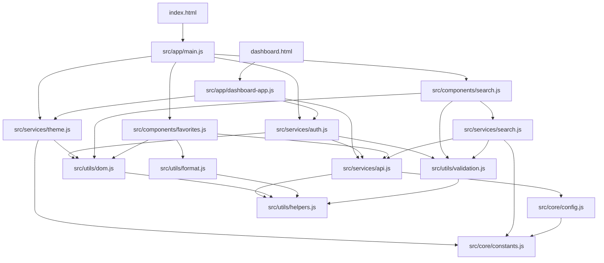

# 磁力快搜 - 专业版

## 🌟 项目简介

磁力快搜是一款现代化的磁力搜索聚合工具，采用ES6模块化架构重构，提供智能搜索、云端同步、收藏管理等功能。支持多平台资源站点聚合，为用户提供一站式搜索体验。

## ✨ 功能特性

### 🔍 智能搜索
- **多源聚合**: 支持JavBus、JavDB、JavLibrary等主流站点
- **搜索建议**: 基于历史记录的智能搜索建议
- **结果缓存**: 智能缓存机制，提升搜索速度
- **快捷键支持**: Ctrl+K快速聚焦搜索框

### ☁️ 云端同步
- **跨设备同步**: 搜索历史、收藏夹云端实时同步
- **数据备份**: 完整的数据导入导出功能
- **离线支持**: 本地缓存，离线也能查看历史数据

### 📚 收藏管理
- **智能收藏**: 一键收藏搜索结果
- **分类整理**: 按关键词、时间等多维度管理
- **批量操作**: 支持批量导入、导出、删除

### 🎨 用户体验
- **响应式设计**: 完美适配桌面、平板、手机
- **主题切换**: 支持浅色/深色主题自动切换
- **现代化UI**: 基于现代设计语言的精美界面

### 🛡️ 安全隐私
- **数据加密**: 本地存储数据加密保护
- **隐私保护**: 最小化数据收集，用户隐私优先
- **安全认证**: 完整的用户认证和权限管理

## 🏗️ 技术栈

### 前端技术
- **前端**: Cloudflare Pages
- **ES6+ Modules**: 现代化模块系统
- **Vanilla JavaScript**: 原生JS，无框架依赖
- **CSS3**: 现代CSS特性，CSS变量
- **HTML5**: 语义化标记，可访问性优化

### 后端技术
- **后端**: Cloudflare Workers
- **数据库**: Cloudflare D1 (SQLite)
- **认证**: JWT + Session管理

### 开发工具
- **ES6 Import/Export**: 模块化开发
- **CSS Custom Properties**: 动态主题切换
- **Web APIs**: 现代浏览器API充分利用
- **Progressive Enhancement**: 渐进式增强

### 浏览器支持
- **现代浏览器**: Chrome 61+, Firefox 60+, Safari 11+, Edge 16+
- **ES6 Modules**: 原生支持ES6模块的浏览器
- **响应式设计**: 支持各种屏幕尺寸


## 🔧 模块依赖关系



## 🚀 快速开始

### 环境要求

- **现代浏览器**: 支持ES6 Modules
- **Web服务器**: 本地开发服务器或生产环境
- **Node.js**: 可选，用于开发工具

### 安装部署

#### 方法一：直接部署
```bash
# 1. 克隆项目
git clone https://github.com/your-repo/magnet-search-app.git

# 2. 进入项目目录
cd magnet-search-app

# 3. 使用Web服务器运行
# Python 3
python -m http.server 8000

# Python 2
python -m SimpleHTTPServer 8000

# Node.js
npx serve .

# 4. 访问应用
open http://localhost:8000
```

#### 方法二：开发环境
```bash
# 1. 安装开发依赖
npm install

# 2. 启动开发服务器
npm run dev

# 3. 构建生产版本
npm run build
```

### 配置说明

#### 环境配置
在 `js/config.js` 中配置应用参数：

```javascript
// API配置
const API_CONFIG = {
  APP_NAME: 'CodeSeek',
  APP_VERSION: '2.0.0',
  BASE_URL: isDev() ? 'http://localhost:8787' : 'https://your-api.com',
  TIMEOUT: 30000,
  MAX_RETRIES: 3
};
```

#### 搜索源配置
在 `src/core/constants.js` 中配置搜索源：

```javascript
SEARCH_SOURCES: [
  {
    id: 'javbus',
    name: 'JavBus',
    subtitle: '番号+磁力一体站，信息完善',
    icon: '🌐',
    urlTemplate: 'https://www.javbus.com/search/{keyword}'
  }
  // 添加更多搜索源...
]
```

## 💻 开发指南

### 代码规范

#### ES6模块导入
```javascript
// ✅ 正确的导入方式
import { showToast } from '../utils/dom.js';
import apiService from '../services/api.js';
import { APP_CONSTANTS } from '../core/constants.js';

// ❌ 避免的导入方式
import * as everything from './module.js';
```

#### 异步处理
```javascript
// ✅ 使用async/await
async function fetchData() {
  try {
    const result = await apiService.getData();
    return result;
  } catch (error) {
    console.error('获取数据失败:', error);
    showToast('操作失败', 'error');
  }
}

// ✅ 错误处理
try {
  await someAsyncOperation();
} catch (error) {
  console.error('操作失败:', error);
  // 用户友好的错误提示
  showToast('操作失败，请重试', 'error');
}
```

#### 事件处理
```javascript
// ✅ 使用事件委托
container.addEventListener('click', (e) => {
  const button = e.target.closest('[data-action]');
  if (!button) return;
  
  const action = button.dataset.action;
  this.handleAction(action, button);
});

// ✅ 防抖处理
import { debounce } from '../utils/helpers.js';

searchInput.addEventListener('input', debounce((e) => {
  this.handleSearch(e.target.value);
}, 300));
```

### 新增功能

#### 添加新的工具函数
1. 在 `src/utils/` 目录创建新文件
2. 使用ES6模块导出
3. 在需要的地方导入使用

```javascript
// src/utils/new-util.js
export function newUtilFunction(param) {
  // 实现逻辑
  return result;
}

// 使用
import { newUtilFunction } from '../utils/new-util.js';
```

#### 添加新的服务
1. 在 `src/services/` 目录创建服务文件
2. 创建服务类并导出
3. 在应用层导入并使用

```javascript
// src/services/new-service.js
class NewService {
  async doSomething() {
    // 服务逻辑
  }
}

export const newService = new NewService();
export default newService;
```

### 调试技巧

#### 开发者工具
- **Console**: 查看错误信息和调试输出
- **Network**: 监控API请求和响应
- **Application**: 检查本地存储和缓存
- **Sources**: 设置断点调试ES6模块

#### 日志输出
```javascript
// 开发环境调试日志
if (window.API_CONFIG?.ENABLE_DEBUG) {
  console.log('调试信息:', data);
}

// 错误追踪
console.error('错误详情:', {
  error: error.message,
  stack: error.stack,
  context: additionalInfo
});
```

## 📡 API集成

### 配置API端点
```javascript
// src/core/config.js
const API_ENDPOINTS = {
  AUTH: '/api/auth',
  SEARCH: '/api/search',
  FAVORITES: '/api/favorites',
  USER: '/api/user'
};
```

### API请求示例
```javascript
// src/services/api.js
async function request(endpoint, options = {}) {
  const response = await fetch(`${API_BASE_URL}${endpoint}`, {
    headers: {
      'Content-Type': 'application/json',
      'Authorization': `Bearer ${token}`
    },
    ...options
  });
  
  if (!response.ok) {
    throw new Error(`API请求失败: ${response.status}`);
  }
  
  return response.json();
}
```

## 🎨 主题定制

### CSS变量系统
```css
:root {
  /* 浅色主题 */
  --bg-primary: #ffffff;
  --text-primary: #111827;
  --accent-primary: #3b82f6;
}

[data-theme="dark"] {
  /* 深色主题 */
  --bg-primary: #111827;
  --text-primary: #f9fafb;
  --accent-primary: #60a5fa;
}
```

### 主题切换
```javascript
// src/services/theme.js
toggleTheme() {
  const currentTheme = this.getCurrentTheme();
  const newTheme = currentTheme === 'light' ? 'dark' : 'light';
  
  document.documentElement.setAttribute('data-theme', newTheme);
  localStorage.setItem('theme', newTheme);
}
```

## 📱 响应式设计

### 断点系统
```css
/* 移动设备 */
@media (max-width: 768px) {
  .container {
    padding: 1rem;
  }
}

/* 平板设备 */
@media (max-width: 1024px) {
  .sidebar {
    width: 240px;
  }
}

/* 桌面设备 */
@media (min-width: 1025px) {
  .container {
    max-width: 1280px;
  }
}
```

## 🔒 安全考虑

### XSS防护
```javascript
// 使用HTML转义
import { escapeHtml } from '../utils/format.js';

element.innerHTML = escapeHtml(userInput);
```

### CSRF防护
```javascript
// API请求中包含CSRF令牌
headers: {
  'X-CSRF-Token': getCsrfToken(),
  'Content-Type': 'application/json'
}
```

### 数据验证
```javascript
// 输入验证
import { validateSearchKeyword } from '../utils/validation.js';

const validation = validateSearchKeyword(input);
if (!validation.valid) {
  showToast(validation.errors[0], 'error');
  return;
}
```

## 🚀 部署指南

### 生产环境配置

#### Nginx配置
```nginx
server {
    listen 80;
    server_name your-domain.com;
    root /path/to/magnet-search-app;
    index index.html;

    # ES6模块MIME类型
    location ~* \.js$ {
        add_header Content-Type application/javascript;
    }

    # SPA路由支持
    location / {
        try_files $uri $uri/ /index.html;
    }

    # 缓存静态资源
    location ~* \.(css|js|png|jpg|jpeg|gif|ico|svg)$ {
        expires 1y;
        add_header Cache-Control "public, immutable";
    }
}
```

#### CDN部署
```bash
# 构建优化版本
npm run build

# 上传到CDN
aws s3 sync dist/ s3://your-bucket-name/ --delete

# 配置CloudFront缓存策略
```

### 环境变量
```bash
# 生产环境
export NODE_ENV=production
export API_BASE_URL=https://api.your-domain.com
export ENABLE_ANALYTICS=true

# 开发环境
export NODE_ENV=development
export API_BASE_URL=http://localhost:8787
export ENABLE_DEBUG=true
```

## 📊 性能优化

### 代码分割
```javascript
// 动态导入
async function loadDashboard() {
  const { DashboardApp } = await import('./src/app/dashboard-app.js');
  return new DashboardApp();
}
```

### 资源预加载
```html
<!-- 预加载关键资源 -->
<link rel="preload" href="src/app/main.js" as="script">
<link rel="preload" href="css/style.css" as="style">
```

### 缓存策略
```javascript
// Service Worker缓存
const CACHE_NAME = 'magnet-search-v2.0.0';
const CACHE_URLS = [
  '/index.html',
  '/css/style.css',
  '/src/app/main.js'
];
```

## 🐛 错误处理

### 全局错误捕获
```javascript
// 捕获未处理的错误
window.addEventListener('error', (event) => {
  console.error('全局错误:', event.error);
  // 发送错误报告
  reportError(event.error);
});

// 捕获Promise拒绝
window.addEventListener('unhandledrejection', (event) => {
  console.error('未处理的Promise拒绝:', event.reason);
  event.preventDefault();
});
```

### 用户友好错误
```javascript
// 显示用户友好的错误信息
function handleError(error, context) {
  const userMessage = ERROR_MESSAGES[error.code] || '操作失败，请重试';
  showToast(userMessage, 'error');
  
  // 开发环境显示详细错误
  if (isDev()) {
    console.error(`错误上下文: ${context}`, error);
  }
}
```

## 🔄 更新日志

### v2.0.0 (2024-12-XX)
- ✨ **ES6模块化重构**: 完全重写为现代化模块架构
- 🎨 **UI/UX优化**: 全新的响应式设计和主题系统
- ☁️ **云端同步**: 完整的数据同步和备份功能
- 🔒 **安全增强**: 改进的认证系统和数据保护
- 📱 **移动优化**: 更好的移动端体验
- 🚀 **性能提升**: 优化加载速度和内存使用

### v1.0.0 (2024-XX-XX)
- 🎉 **初始发布**: 基础搜索和收藏功能
- 🔍 **多源聚合**: 支持主流磁力站点
- 💾 **本地存储**: 基础的数据存储功能

## 🤝 贡献指南

### 参与贡献

1. **Fork项目** 到你的GitHub账户
2. **创建特性分支** `git checkout -b feature/amazing-feature`
3. **提交更改** `git commit -m 'Add amazing feature'`
4. **推送分支** `git push origin feature/amazing-feature`
5. **创建Pull Request**

### 代码规范

- 使用ES6+语法
- 遵循模块化设计原则
- 添加适当的注释和文档
- 包含单元测试（如适用）
- 遵循现有的代码风格

### 问题报告

提交Issue时请包含：
- 操作系统和浏览器版本
- 重现步骤
- 期望行为
- 实际行为
- 错误截图或日志

## 📄 许可证

本项目采用 MIT 许可证 - 查看 [LICENSE](LICENSE) 文件了解详情。

## 💬 联系我们

- **项目主页**: [GitHub Repository](https://github.com/your-repo/magnet-search-app)
- **问题反馈**: [Issues](https://github.com/your-repo/magnet-search-app/issues)
- **功能建议**: [Discussions](https://github.com/your-repo/magnet-search-app/discussions)

## 🙏 致谢

感谢所有为这个项目做出贡献的开发者们！

---

**⭐ 如果这个项目对你有帮助，请给我们一个Star！**